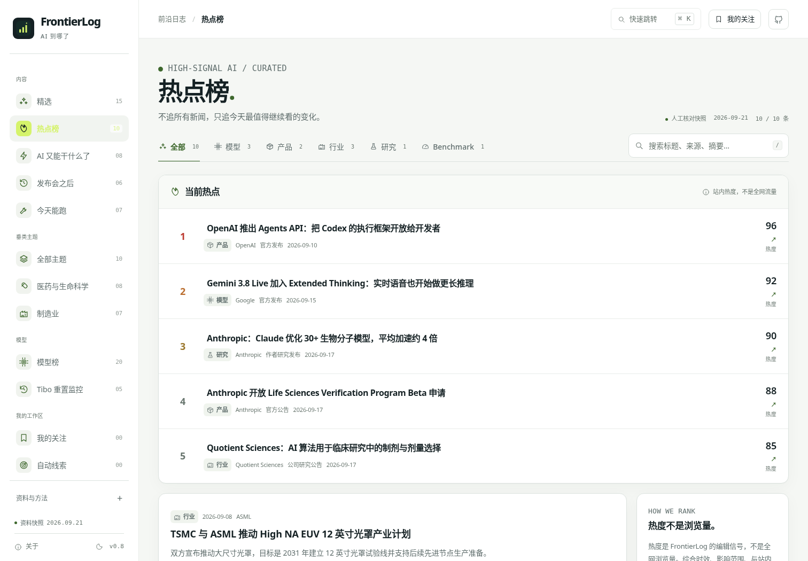
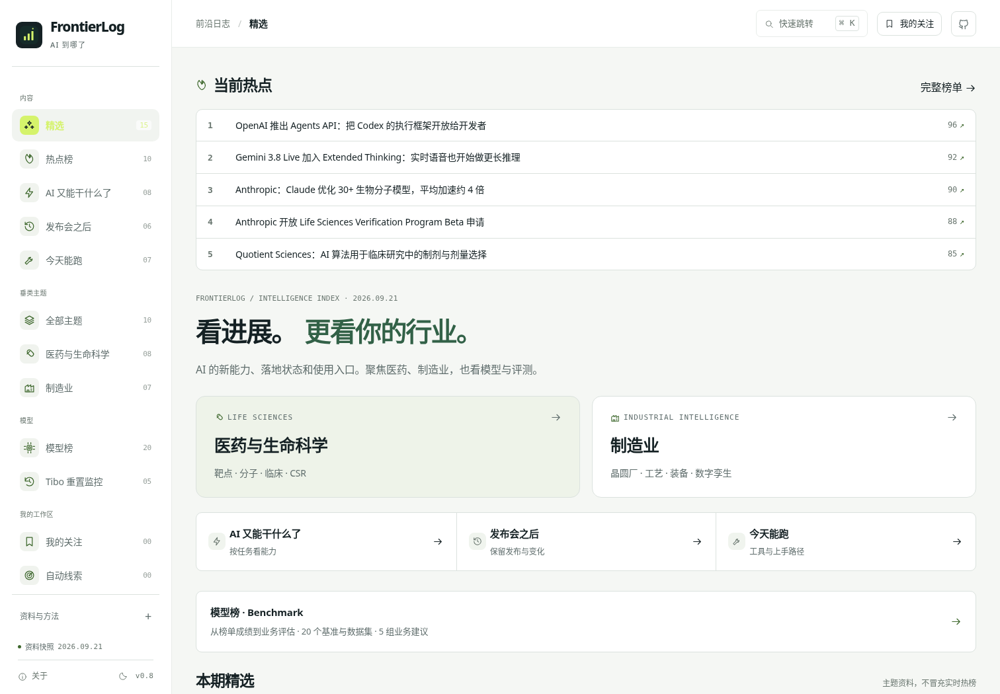

# FrontierLog · AI 到哪了

**热点负责发现，模型中心负责比较，垂类主题负责落到业务。**

v0.6 新增「热点榜」，并把 Benchmark 收进「模型榜」成为同一模型中心的二级入口。继续保留医药 / 制造业主题、Tibo 重置监控、任务进度、发布会之后和今天能跑。



## v0.7 视觉与检索层级

- 热点榜把分类 Tab 与搜索框合并到同一工具栏，桌面端一行完成分类与检索。
- 统一页面宽度、卡片圆角、控件高度、边框与 hover 反馈；顶部导航改为轻量粘性栏。
- 模型榜与 Benchmark 继续作为同一个模型中心，视觉节奏统一。
- 移动端保留横向分类滑动，搜索独立一行，避免拥挤与横向溢出。
- 本次只调整信息架构与视觉，不改变热点数据口径或自动采集状态。

## v0.6 两个主要变化

### 1. 热点榜

`#/hot` 提供全部、模型、产品、行业、研究、Benchmark 六类。前五条使用紧凑榜单，后续以信息流展开；精选首页同步露出五条热点。

页面显示的是 **FrontierLog 站内热度**，不是全网浏览量。当前 10 条为人工核对快照，保留来源日期、原始链接、为什么值得看和不能过度解读的边界。静态页面刷新不会去抓上游。

数据出口：`api/v1/hot.json`；RSS：`feeds/hot.xml`。详见 [热点榜口径](docs/HOTLIST.md)。

### 2. Benchmark 收进模型榜

侧栏不再单列 Benchmark。进入「模型榜」后，顶部使用两级结构：

- **模型排行**：Artificial Analysis / Arena 等同源模型榜；
- **Benchmark**：基准目录、方法变化、业务评估与汇报清单。

旧 `#/benchmarks` 深链接继续工作，并保持左侧「模型榜」高亮；这样不会破坏已分享的链接，又能在信息架构上归入模型中心。


## 品牌与布局

统一信号柱 SVG 标识、FrontierLog 字标、中文副标“AI 到哪了”、面包屑、favicon 和侧栏。品牌区固定，导航在小高度下独立滚动，资料与方法折叠，顶部仅保留搜索、关注和 GitHub 图标。界面不依赖远程字体。



## 保留的功能

原有 8 个任务档案、10 个行业主题与 15 篇专题资料、20 个模型配置摘录及 5 条重置记录未被此版本替换。它们保留原有来源、快照和未核验状态；本次新增 Benchmark 资料的核对日期不代表其他模块已再次完整核查。

主栏目为精选、AI 又能干什么了、发布会之后、今天能跑；另含主题、模型、重置、我的关注、自动线索和精选简报。旧深链接继续有效。

## 直接查看或构建

`dist/index.html` 内嵌全部前端与快照，可直接打开。Python 构建只使用标准库，不需要模型 Key。

```bash
python3 -m unittest discover -s tests -p 'test_*.py' -v
python3 scripts/build.py
python3 -m http.server 8000 --directory dist --bind 127.0.0.1
```

示例入口：`#/benchmarks`、`#/benchmarks?group=pharma`、`#/benchmarks?mode=suites`。

## 更新现有网站

静态发布包中 `frontierlog-upload` **里面**的文件与 `api/`、`feeds/`、`assets/` 上传至现有仓库根目录。不要上传 ZIP，不要多套一层文件夹。保持既有 `main` / `/ (root)` Pages 发布配置。

目标：`https://momo-hub-learn.github.io/frontierlog/`。这是部署目标；本次交付只在本地构建和测试，未向仓库提交，未替换线上页面。

## 自动化边界

完整源码保留既有 GitHub Actions 工作流。它在被部署与授权后可按配置收录行业线索、调用可选 AA / X API；密钥只能放服务端 Secrets。静态上传包不启用这些采集器。

**该工作流没有 Benchmark 采集或自动跑分步骤。** 修改 `data/benchmarks.json` 并重新构建后，目录、JSON 和 Benchmark RSS 才会一起更新。旧材料被查看不变成新发布；个人勾选检查项也不会产生“本站实测”标记。

详见 [部署说明](docs/deployment.md) 和 [既有模型/重置模块](docs/MODELS_AND_RESETS.md)。

## 结构

```text
src/index.html, styles.css, app.js       原有应用与品牌结构
src/vertical.js, vertical.css            行业专题
src/models.js, models.css                模型与重置
src/benchmarks.js, benchmarks.css        Benchmark
src/hot.js, hot.css                      热点榜与精选热点入口
src/brand.svg                           矢量标识
data/benchmarks.json                    Benchmark 协议目录与业务建议
data/hot.json                           热点榜人工快照与口径
scripts/benchmark_data.py               校验 Benchmark 与生成 RSS
scripts/hot_data.py                     校验热点榜与生成 RSS
scripts/build.py                       构建完整静态站
tests/test_benchmarks.py                新增数据与构建测试
tests/browser_benchmarks.py             新模块浏览器测试
dist/                                  可上传的网站
docs/                                  设计、来源、测试和示例汇报
```

Benchmark 数据出口：`api/v1/benchmarks.json`；订阅出口：`feeds/benchmarks.xml`。其他模块的 JSON、RSS 与收藏备份保留。

## 隐私和复核

收藏、汇报清单、标题、讨论备注、检查项只保存在访问者自己的浏览器；支持本机备份。分享链接只带基准 ID 与业务组合，不附带个人备注。无邮件推送、远程账号或网站分析脚本。

不要填写患者信息、未公开 CSR、生产日志、凭证或其他无权公开的信息。网页不执行第三方 benchmark 或上传业务资料。导出的评估计划分数和运行配置为空，必须由实际运行者填写。

## 验证

127 项离线单元测试；原有任务 14 组、行业专题 13 组、模型与重置 13 组、Benchmark 13 组、热点榜 8 组浏览器检查通过。浏览器采用内存渲染；同源刷新测试被环境策略阻断，未验证真实来源下持久化、公开网站部署或联网采集。

[完整验收记录](docs/verification.md)。这些是本网站代码测试，**不是运行了 118 个 AI Benchmark**。

代码使用 MIT 许可证；第三方文献、数据和基准仍遵循各自许可。本目录只做必要概述并给出原始来源，不重新分发基准题集或模型权重。
