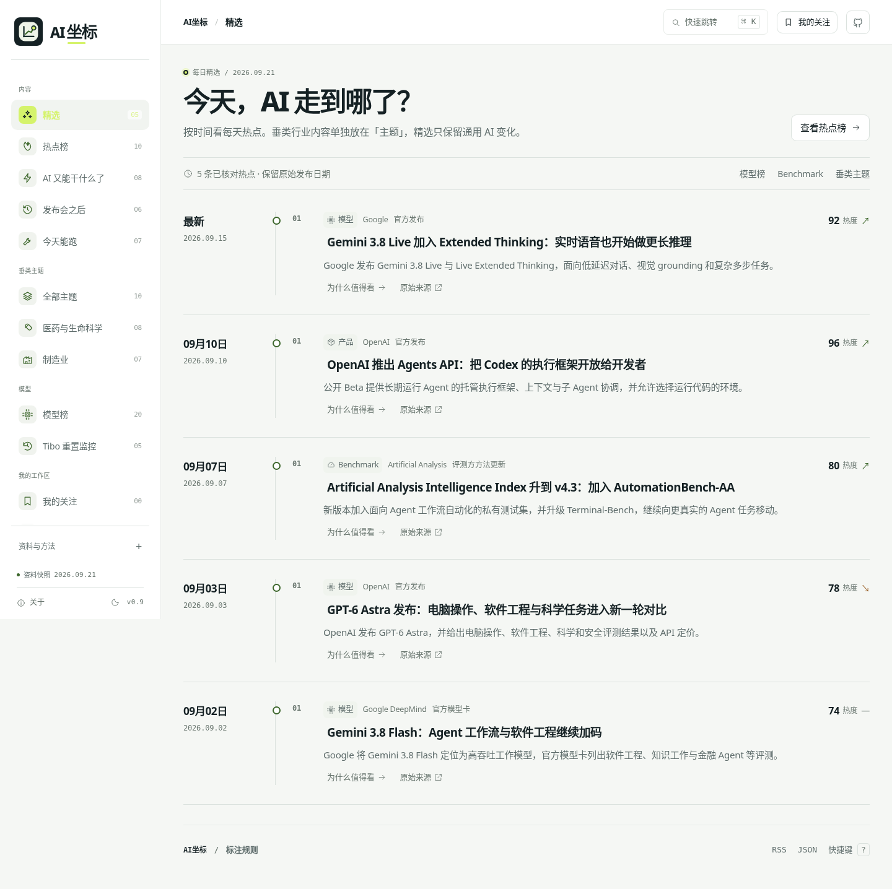

# AI坐标

**看 AI 现在走到哪。**

这是 `frontierlog` 仓库的 v0.9 前台版本。网站品牌已收敛为 **AI坐标**；仓库名与 GitHub Pages 地址保持不变，避免迁移已有链接。



## v0.9 主要变化

- 前台不再同时展示 `FrontierLog / AI 到哪了` 两套名字，统一为 **AI坐标**。
- Logo 改为“坐标轴 + 轨迹 + 定位点”，与资讯站常见的英文字母 Logo 区分。
- `精选` 改成按日期展开的通用 AI 热点时间线。医药、制造业的垂类资料继续放在主题页，不混入精选。
- `热点榜` 保留全部热点；热度数字、热度标签和趋势箭头强制单行。
- `模型榜 / Benchmark / Tibo 重置监控 / 垂类主题 / AI 又能干什么了` 等原有功能保留。
- 页面依旧使用浅灰白、墨绿、青柠色体系，字体与 SVG 小图标体系沿用 v0.8。

## 信息架构

```text
内容
  精选              通用 AI 热点时间线
  热点榜            站内热度排序
  AI 又能干什么了   按任务看能力
  发布会之后        发布与后续变化
  今天能跑          工具与上手路径

垂类主题
  全部主题
  医药与生命科学
  制造业

模型
  模型榜
    └─ Benchmark
  Tibo 重置监控
```

## 更新现有 GitHub Pages

把静态更新包中的 `frontierlog-upload/` **里面的文件**上传到现有 `momo-hub-learn/frontierlog` 仓库根目录，覆盖同名文件并提交到 `main`。不要上传 ZIP，也不要多套一层目录。

现有 Pages 地址保持：

`https://momo-hub-learn.github.io/frontierlog/`

不需要重新设置 Pages。

## 本地构建

```bash
python3 -m unittest discover -s tests -p 'test_*.py'
python3 scripts/build.py --out dist \
  --repo momo-hub-learn/frontierlog \
  --base-url https://momo-hub-learn.github.io/frontierlog/
```

`dist/index.html` 是单文件前端入口；构建本身只使用 Python 标准库。

## 数据与自动化边界

热点、模型、Benchmark 和行业专题均保留来源、发布时间与核对状态。`热度` 是本站编辑信号，不是全网浏览量。

静态上传包只更新网页与数据快照，不会自动开启抓取。完整源码仍保留已有采集与 GitHub Actions 相关文件；上线自动化前需要单独部署、配置权限，并验收首次联网运行。

## 隐私

关注、检查清单和个人备注保存在访问者自己的浏览器。不要提交患者信息、未公开 CSR、产线日志、密钥或其他无权公开的信息。

MIT 许可证仅覆盖本项目代码；第三方资料和基准遵循各自许可。
